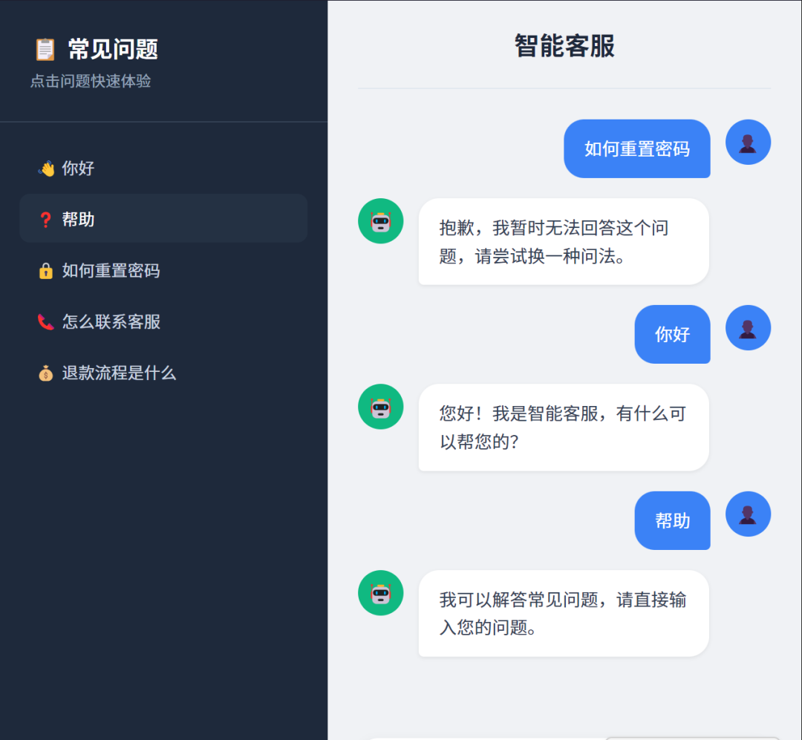
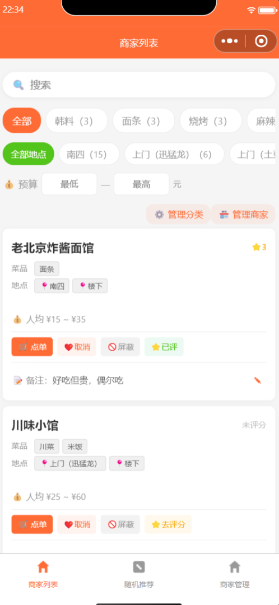
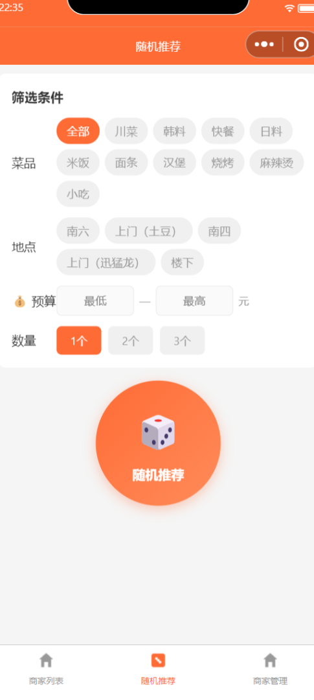

# AI 研发自动化工作流模板仓库

## 这是什么？

本仓库是一套**通用 AI 研发自动化闭环工作流模板**，从「爱穿搭 AI 试衣」项目 (`ai-tryon-workflow`) 的实际落地经验中萃取而来。

适用通过 **TAPD** 管理需求、**CodeBuddy** 辅助开发、**CNB** 管理 CI/CD 的任意项目。

支持四种研发命令和完整的迭代生命周期：

| 命令 | 用途 | 适用场景 |
|------|------|----------|
| `/newdev` | 单需求闭环 | 单一最小需求单元，一次自动完成 Spec→开发→测试→Review→MR→合并→归档 |
| `/epicdev` | 大功能批量闭环 | 大功能先拆解为多个最小需求单元，批量创建 TAPD 需求，按依赖顺序逐个自动执行闭环 |
| `/dailymaintain` | 每日维护 | 检查未完成需求、未合并 MR、失败流水线、未提交代码、知识库同步、经验沉淀 |
| `/iteration` | 迭代生命周期 | 迭代启动（`--start`）、状态查询（`--status`）、版本收口（`--release`） |

完整研发方式：

```
1. 前期配置规则和知识库
2. /iteration --start v0.x.0     # 启动迭代
3. /epicdev --plan {大功能}        # 拆解计划
4. /epicdev --yes {大功能}         # 批量执行
5. /dailymaintain                  # 每日维护
6. /iteration --release v0.x.0    # 版本收口
7. 同步通用经验到模板仓库
8. 进入下一轮迭代
```

## 如何使用

### 一页速览

这套工作流按迭代循环推进：先定范围 → 拆需求 → 自动开发 → 每日维护 → 版本收口 → 经验沉淀 → 下一轮迭代。

| 场景 | 命令 | 说明 |
|------|------|------|
| 新项目初始化 | 初始化提示词 | 复制模板、生成业务知识库、初始化 Rules/Commands/CNB/FastAPI/pytest |
| 启动迭代 | `/iteration --start v0.x.0` | 明确本轮目标、边界、风险、依赖、人工介入点 |
| 开发大功能 | `/epicdev --plan` / `--yes` | 拆成多个最小需求，在 TAPD 创建并顺序开发 |
| 开发小功能 | `/newdev --yes 增加xxx` | 自动创建需求并完成研发闭环 |
| 每日维护 | `/dailymaintain` | 检查 TAPD、MR、CNB、未提交文件、知识库和模板经验 |
| 收口版本 | `/iteration --release v0.x.0` | 检查本轮完成度，归档版本，生成下一轮建议 |

### 详细流程

#### 1. 新项目初始化

新业务项目必须先初始化，再开始开发。初始化提示词模板：

> 请基于 ai-dev-workflow-template 初始化当前新业务项目。
> 当前项目路径：E:\workspace\{PROJECT_NAME}
> 模板仓库路径：E:\workspace\ai-dev-workflow-template
> 业务名称：{BUSINESS_NAME}
> ...
> 请自动生成业务知识库，初始化 Rules、Commands、CNB、FastAPI、pytest，并提交 push。

详见 [新项目初始化指南](./NEW_PROJECT_SETUP.md)。

#### 2. 迭代生命周期

一个迭代版本是一批最小需求单元。建议每天维护一次，用完一轮就收口，沉淀经验，然后进入下一轮。

| 阶段 | 命令 | 必须完成 |
|------|------|----------|
| 迭代启动 | `/iteration --start v0.x.0` | 读取规则和知识库，明确目标和非目标，输出迭代计划 |
| 需求开发 | `/epicdev` 或 `/newdev` | 大功能先拆解，小需求直接闭环 |
| 每日维护 | `/dailymaintain` | 检查未完成需求、失败流水线、未提交文件、知识库落后 |
| 版本收口 | `/iteration --release v0.x.0` | 确认需求完成、MR 合并、流水线通过、TAPD 归档、经验沉淀 |

#### 3. 大功能拆解

大功能不要直接交给 `/newdev`，先用 `/epicdev --plan` 拆解：

```
/epicdev --plan 我要增加用户登录、个人中心和历史记录功能
```

确认拆解合理后：

```
/epicdev --yes 我要增加用户登录、个人中心和历史记录功能
```

**约束**：默认最多拆解 5 个需求，每次最多自动执行 3 个，有依赖关系的按顺序执行。

#### 4. 单个需求开发

```
/newdev --yes 增加历史记录查询接口
```

标准闭环：创建 TAPD 需求 → 读取规则和知识库 → 生成 Spec → 创建分支 → 开发代码 → 写测试 → pytest → 覆盖率检查 → AI Review → 自动修复 → commit → push → MR → CNB 检查 → 自动合并 → TAPD 归档。

#### 5. 每日维护

每天执行一次 `/dailymaintain`，用于发现遗漏的同步、MR、CNB、知识库和模板经验问题。

#### 6. 效果反馈修复

页面效果失败或 CNB 失败时，进入修复闭环：

```
页面效果失败：点击按钮后没有显示结果图。
请进入 EffectFeedbackLoopRules 修复闭环。
```

#### 7. 人工介入

遇到密钥配置、MCP 授权、服务器购买、域名配置等需暂停。完成配置后输入：

```
人工配置已完成，请继续闭环。
```

#### 8. 版本收口

```
/iteration --release v0.x.0
```

#### 9. 经验沉淀

- **业务经验** → 当前业务仓库 `.codebuddy/knowledge/`
- **通用经验** → `ai-dev-workflow-template` 模板仓库

### 完成判定清单

每次报告完成，必须包含：

- [ ] 本地测试通过
- [ ] 覆盖率达标（>= 90%）
- [ ] AI Review 通过（>= 95）
- [ ] 知识库已更新
- [ ] git status clean
- [ ] commit 已 push
- [ ] MR 已创建/更新
- [ ] CNB 流水线通过
- [ ] TAPD 已归档

## 完整研发周期

```
前期规范约束
  → 迭代启动（/iteration --start v0.x.0）
  → 大功能拆解（/epicdev --plan {大功能}）
  → 最小需求单元创建与开发（/newdev 逐个执行）
  → 每日维护（/dailymaintain）
  → 每条需求完成后沉淀经验
  → 版本收口（/iteration --release v0.x.0）
  → 同步通用经验到模板仓库
  → 进入下一轮迭代
```

## 自动研发闭环流程

```
TAPD 需求 / 自动创建需求 / 大功能拆解 / 迭代启动
    → CodeBuddy 读取知识库与规则
    → 判断最小需求单元（或拆解大功能）
    → AI生成Spec中（TAPD 状态同步）
    → 生成 Spec 设计文档
    → AI开发中（TAPD 状态同步）
    → 创建功能分支
    → 自动实现代码
    → AI测试中（TAPD 状态同步）
    → pytest + 覆盖率检查
    → AI审核中（TAPD 状态同步）
    → AI Code Review
    → AI自动修复中（按需）
    → 待自动合并（TAPD 状态同步）
    → 创建 MR → CNB 状态检查 → 自动合并
    → CNB main push 流水线
    → TAPD 自动归档为「已完成」
```

## 三种内容分类

### ✅ 可直接复用

| 文件/配置 | 说明 |
|-----------|------|
| `scripts/check_coverage.py` | 覆盖率门禁脚本（无需修改） |
| `scripts/tapd_archive.py` | TAPD 自动归档脚本（需配置环境变量） |
| TAPD 状态流转设计 | 待AI分析→...→已完成（9 状态） |
| Spec 规范 | 设计文档模板 |
| AI Review 规范 | 代码审查标准 |
| 质量门禁规范 | 覆盖率>=90%、AI Review>=95 |
| CNB 流水线结构 | pull_request 质量门禁 + push 归档（模板见 templates/cnb-pipeline-template.yml） |
| 执行护栏规则 | 强制预检 + 分支保护 + 本地验证 + 推送 + MR + 闭环报告 |
| 效果反馈修复闭环 | 问题复现 → 修复 → 验证 → 推送 → CNB 检查 |
| 经验分层沉淀规则 | 业务经验/通用经验/混合经验分层沉淀 |
| 闭环完成判定规则 | PR 流水线 + Push 流水线全部通过才算完成 |
| 人工介入断点规则 | 暂停条件、密钥处理、恢复执行规则 |
| 大功能拆解规则 | 拆解为最小需求单元、批量创建、顺序执行 |
| 迭代生命周期规则 | 迭代启动、每日维护、版本收口、经验沉淀 |

### ⚠️ 必须替换

| 内容 | 替换目标 |
|------|----------|
| `{TAPD_WORKSPACE_ID}` | 你的 TAPD 项目 ID |
| `{DEFAULT_ITERATION}` | 你的迭代名称 |
| `{BIZ_PREFIX}` | 你的业务前缀（如 order、chatbot） |
| `{BUSINESS_NAME}` | 你的业务名称 |
| `.codebuddy/knowledge/` | **完全重写**为你的项目知识库 |
| `src/`、`tests/` | 你的业务代码 |

### ❌ 禁止复制到新项目

| 内容 | 原因 |
|------|------|
| 真实 API 密钥 | 安全 |
| CNB 密钥仓库内容 | 安全 |
| 用户数据/图片 | 隐私 |
| 真实模型 Token/URL | 安全 |
| 私有服务地址 | 安全 |

## 快速开始

1. [新项目初始化指南](./NEW_PROJECT_SETUP.md) — 从零搭建
2. [复用检查清单](./docs/workflow-template/REUSE_CHECKLIST.md) — 逐项确认
3. [TAPD 配置](./docs/workflow-template/TAPD_SETUP.md) — 项目与状态配置
4. [CodeBuddy 配置](./docs/workflow-template/CODEBUDDY_SETUP.md) — MCP 与 Rules
5. [CNB 配置](./docs/workflow-template/CNB_SETUP.md) — 流水线与密钥

## 目录结构

```
ai-dev-workflow-template/
├── .cnb.yml                             # 模板仓库自检流水线（不可用于业务项目）
├── workflow.config.example.yml          # 工作流配置示例
├── README.md                            # 本文件
├── NEW_PROJECT_SETUP.md                 # 新项目初始化指南
├── .gitignore
├── scripts/
│   ├── check_coverage.py                # 覆盖率门禁脚本
│   └── tapd_archive.py                  # TAPD 自动归档脚本
├── .codebuddy/
│   ├── rules/                           # CodeBuddy 规则模板
│   │   ├── AutonomousWorkflowRules.mdc  #   总控规则（必须替换参数）
│   │   ├── CodingStandardRules.mdc      #   代码规范（按需替换）
│   │   ├── DesignSpecRules.mdc          #   Spec 规范
│   │   ├── EffectFeedbackLoopRules.mdc  #   效果反馈修复闭环规则
│   │   ├── EpicRequirementDecompositionRules.mdc #   大功能拆解为最小需求单元
│   │   ├── IterationLifecycleRules.mdc  #   迭代生命周期规则
│   │   ├── ExecutionGuardRules.mdc      #   执行护栏规则（强制预检+流水线检查）
│   │   ├── ExperienceLayeringRules.mdc  #   经验分层沉淀规则
│   │   ├── GitBranchRules.mdc           #   分支规范（替换 biz_prefix）
│   │   ├── HumanInterventionRules.mdc   #   人工介入断点规则（暂停条件+密钥处理）
│   │   ├── SecurityRules.mdc            #   安全规范
│   │   ├── UnitTestRules.mdc            #   测试规范
│   │   ├── WorkflowCompletionRules.mdc  #   闭环完成判定规则
│   │   └── WorkflowRules.mdc            #   流程规范
│   └── knowledge-template/              # 知识库模板（新项目必须重写）
│       ├── 01_项目概述.md
│       ├── 02_架构设计.md
│       ├── 03_核心模块.md
│       ├── 04_接口规范.md
│       └── 05_开发指南.md
├── docs/
│   └── workflow-template/               # 完整配置文档
├── templates/                           # 独立模板文件
│   ├── tapd-requirement-template.md
│   ├── newdev-command-template.md
│   ├── epicdev-command-template.md
│   ├── iteration-command-template.md
│   ├── dailymaintain-command-template.md
│   ├── autonomous-workflow-rules-template.mdc
│   ├── EpicRequirementDecompositionRules-template.mdc
│   ├── IterationLifecycleRules-template.mdc
│   ├── HumanInterventionRules-template.mdc
│   ├── cnb-pipeline-template.yml        # CNB 流水线模板（新业务项目复制此文件）
│   ├── rules/                           # 通用规则模板（新项目复制到 .codebuddy/rules/）
│   │   ├── ExecutionGuardRules.mdc
│   │   ├── EffectFeedbackLoopRules.mdc
│   │   ├── ExperienceLayeringRules.mdc
│   │   ├── WorkflowCompletionRules.mdc
│   │   ├── HumanInterventionRules.mdc
│   │   ├── EpicRequirementDecompositionRules.mdc
│   │   └── IterationLifecycleRules.mdc
│   └── knowledge-files/
└── reports/                             # 归档报告（.gitignore 忽略）
```

## 技术栈支持

本模板以 **Python/FastAPI** 为主要示例，但工作流设计不绑定语言：

| 组件 | 语言无关 |
|------|----------|
| TAPD 需求管理 | ✅ |
| CodeBuddy AI 开发 | ✅ |
| TAPD 状态流转 | ✅ |
| Spec 设计规范 | ✅ |
| AI Code Review | ✅ |
| CNB 流水线框架 | ✅ |
| `/newdev` 命令 | ✅ |
| `/epicdev` 命令 | ✅ |
| `/iteration` 命令 | ✅ |
| `/dailymaintain` 命令 | ✅ |
| TAPD 归档脚本 | ✅ (Python 脚本可独立运行) |
| 覆盖率门禁 | 需替换为对应语言的覆盖率工具 |
| 测试命令 | 需替换为对应语言的测试框架 |

## 实现效果

以下是使用本工作流模板已落地的业务项目效果展示：

### AI 试衣功能

「爱穿搭」AI 试衣 — 上传人物照片和服装照片，AI 自动生成虚拟试衣效果。


### FAQ 智能问答系统

FAQ 问答系统 — 基于知识库的智能问答，支持多轮对话和上下文理解。



### 外卖商家管理与随机推荐

外卖商家管理与随机推荐微信小程序 — 商家信息管理、随机推荐、多维度筛选。





## 参考项目

本模板的参考实现：

| 项目 | 链接 | 说明 |
|------|------|------|
| ai-tryon-workflow | [CNB](https://cnb.cool/liugouer-2026/ai-tryon-workflow) | 「爱穿搭」AI 试衣 |
| ai-faq-workflow | CNB | FAQ 智能问答系统 |
| ai-merchant-workflow | CNB | 外卖商家管理与随机推荐 |

所有需求均通过本模板描述的工作流自动完成。

## License

本模板使用 MIT License。参考项目中的业务代码为参考项目所有。
